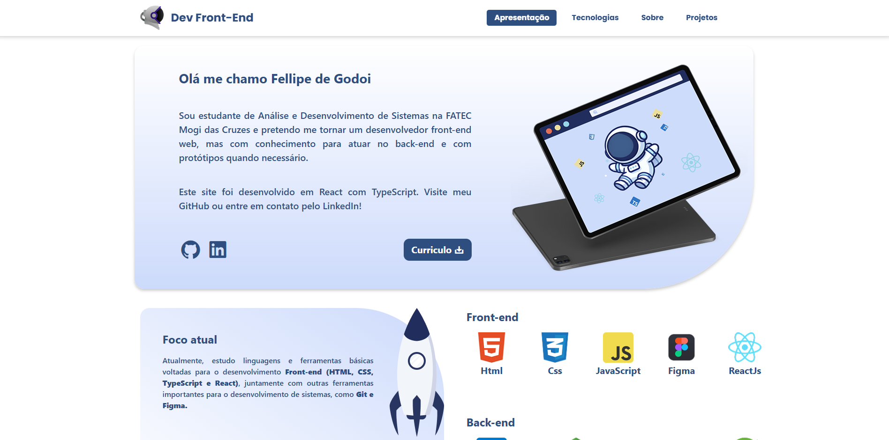
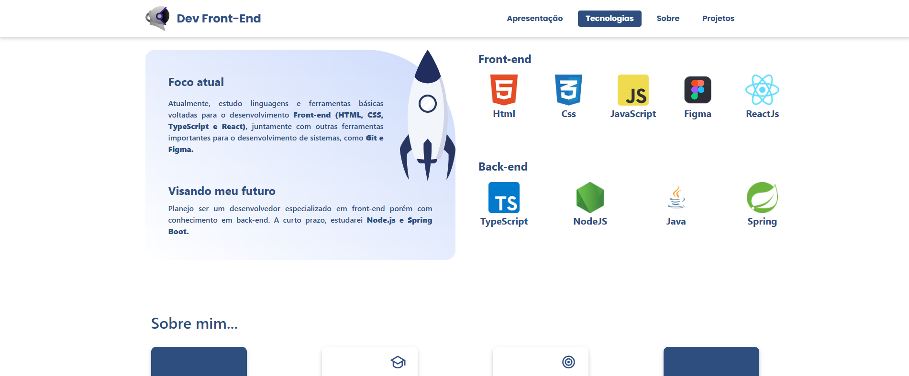
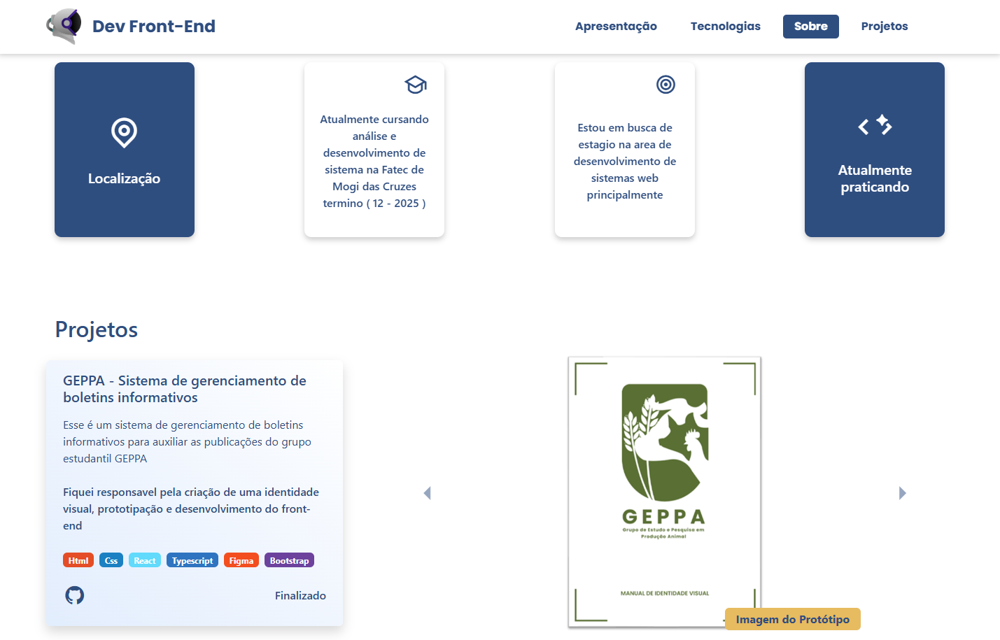
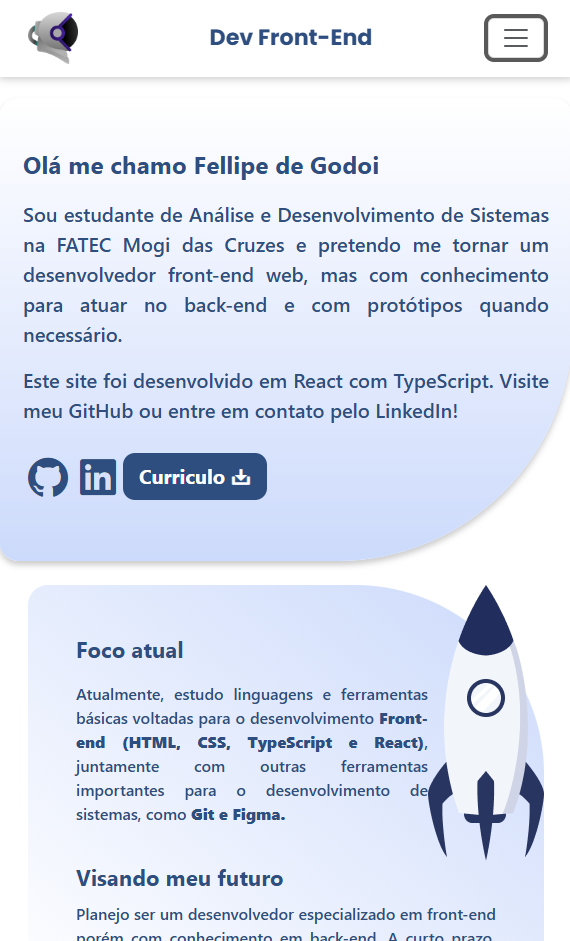
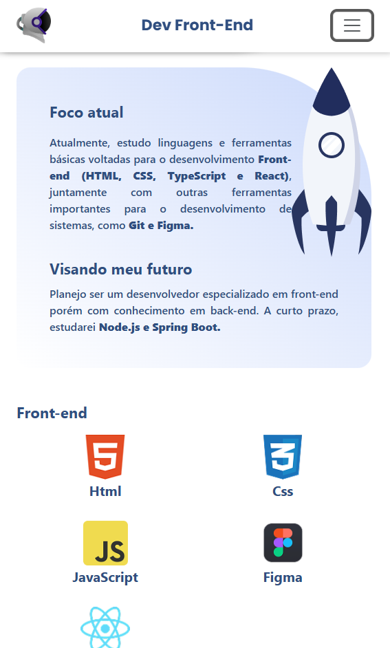
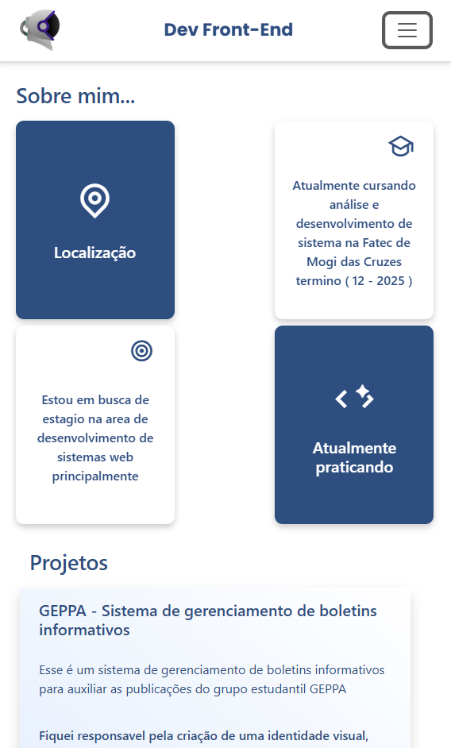
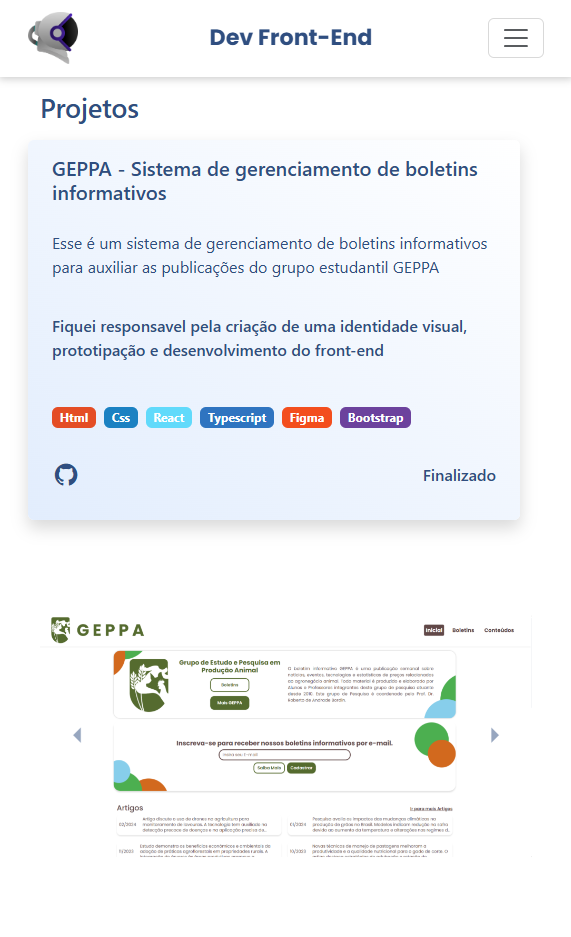

# Portifolio com React, TypesScript e Bootstrap

Bem-vindo ao meu portfólio! Este projeto foi desenvolvido utilizando React, TypeScript e Bootstrap para apresentar meus trabalhos e habilidades como desenvolvedor front-end.

## Tecnologias utilizadas
* React - Biblioteca JavaScript para criação de interfaces dinâmicas.

* TypeScript - Superset do JavaScript que adiciona tipagem estática.

* Bootstrap - Framework CSS para criação de layouts responsivos.

* Vite - Ferramenta para construção e otimização do projeto.

## Como inicializar o projeto
* Após baixar/clonar o repositório, abra um terminal no diretório do projeto.
* Instale as dependências necessárias:
```
    npm install
```
* Inicie o projeto

```
    npm run dev
```

## Imagens 
### (1920 px largura)



<br/>



<br/>




### (600 px de largura)



